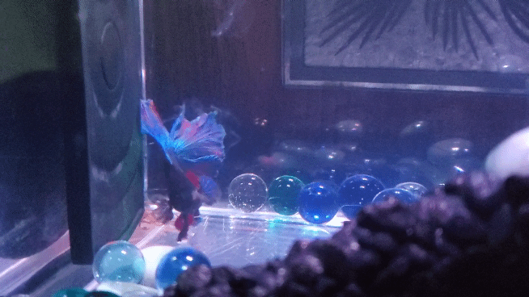

```{r setup, include=FALSE}
knitr::opts_chunk$set(echo = TRUE)
```

## Find a fish .gif and add it below!


Candice's .gif


Kate's .gif

![Caption here.] (FILE NAME HERE)


Jon's .gif

![Caption here.] (FILE NAME HERE)